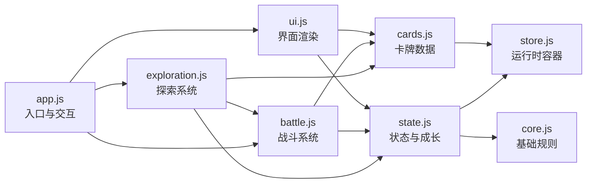

# 《梅林的魔法书》前端架构

## 目录

```text
public/
├─ game.html                         # 页面骨架，不承载业务逻辑
└─ merlin-assets/
   ├─ grimoire-game.css             # 全局视觉主题
   └─ game/
      ├─ app.js                     # 入口、DOM 事件和宿主通信
      ├─ battle.js                  # 战斗回合、抽牌、支付与效果结算
      ├─ cards.js                   # 85 张战斗咒语和 8 张被动卡的数据
      ├─ content.js                 # 探索事件的名称、图标和文案
      ├─ core.js                    # 元素定义、通用工具和方差函数
      ├─ exploration.js             # 事件处理、学卡、升级、转化与重开流程
      ├─ state.js                   # 角色数值、成长、序列化与存档迁移
      ├─ store.js                   # 唯一运行时状态入口
      └─ ui.js                      # 探索、魔法书、档案和商店的渲染
```

## 依赖方向



`app.js` 是唯一入口。系统模块不得反向依赖 `app.js`；卡牌和事件的静态定义应优先保持在数据模块中。

## 常见迭代入口

| 需求 | 优先修改 | 回归重点 |
|---|---|---|
| 新增或调整咒语 | `cards.js` | 卡牌 ID 唯一、消耗类型、残响和完整施法 |
| 调整某类卡的结算 | `battle.js` | 元素支付、多段目标转移、方差和状态消耗 |
| 新增探索事件 | `content.js` + `exploration.js` | 事件展示、结算、存档和层数推进 |
| 调整等级曲线 | `state.js` | 新开一轮、旧存档恢复和属性上限 |
| 调整页面结构或卡牌展示 | `game.html` + `ui.js` | 桌面端、移动端与空状态 |
| 调整样式 | `grimoire-game.css` | 760px 和 460px 响应式断点 |

## 状态与存档约定

- `store.js` 中的 `state` 是唯一游戏状态，不要在各系统内创建第二份长期状态。
- 持久化字段新增后，必须在 `freshState()` 提供默认值，并在 `hydrate()` 兼容旧存档。
- 与外层账号容器通信仍使用 `merlin:ready`、`merlin:state`、`merlin:load` 和 `merlin:new`。
- 每次可持久化操作结束后调用 `saveState()`；战斗逐帧渲染不触发云存档。

## 验证

```bash
npm run lint
npm test
```

`tests/rendered-html.test.mjs` 会检查模块文件完整性、85 张战斗卡数量、关键规则所属模块以及 Cloudflare Pages 构建入口。

## 设计文档同步

代码变更如果会改变玩家实际体验到的规则、数值或流程，必须同步更新相关设计 MD；如果只是修复实现错误，使其恢复已有设计预期，则不修改设计 MD。完整判定标准见 [AGENTS.md](./AGENTS.md)。
